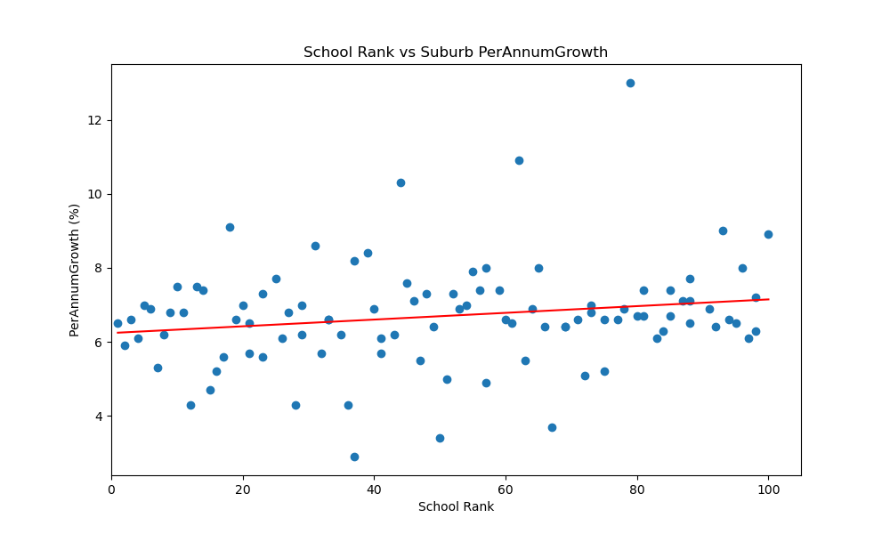
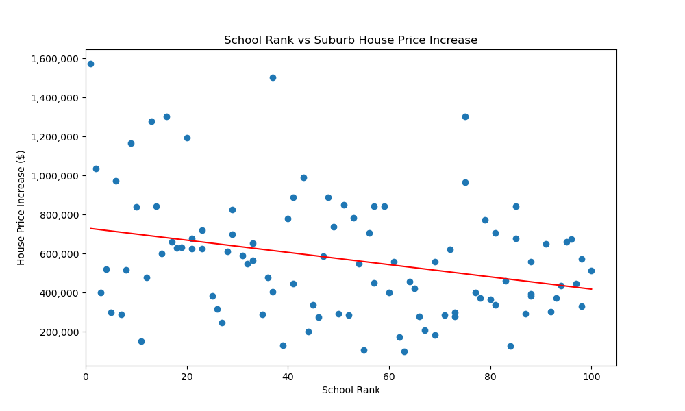

## Housing Affordability​ in Melbourne

Project Proposal: Property Affordability in Melbourne, Victoria

In this project, we will delve into house price data in Melbourne, Victoria. Our analysis aims to address several key questions:

Price Trends Over Time: Analyse historical price data to understand trends for houses in Melbourne region. Determine if there are specific periods when house prices surge or decline. (how do we attribute the periods of surge to our conclusion? What caused the surge? Interest rate? Wage growth? population growth?)

Suburb Popularity: Identify the most popular suburbs in Melbourne. (highest population growth)

Rental Price Impact: Explore the correlation between rental price fluctuations and housing market trends.

Additional Research Questions: Investigate other factors contributing to the housing market’s growth as wage growth, interest rates, population growth and etc.

Data Sources for the project analysis:

Components Contributing to Housing Affordability - 
* Population
* Inflation/Interest Rates
* School Ranking
* Salary

---------
## Analysis of Population growth as a factor to rising Housing Prices​

The first factor we will attend to is the population growth vs. housing price.​  Melbourne’s population growth stems from overseas migration, interstate relocation and natural growth.​
As population grows, the demand for housing grows which in turn increases the price of housing.​ 

The high Pearson correlation coefficient indicates that as the estimated population in Victoria increases, Melbourne housing prices also increase. This suggests a strong relationship between population growth and housing prices.​
The very low P-values from both the correlation test and the t-test indicate that these findings are highly unlikely to be due to random chance. This gives us confidence that the observed relationship between population and housing prices is real and significant.​

##  Analysis of Melbourne's Housing Crisis: Rising Costs (Inflation), and Interest Rates and Household Debt to Income (2013-2023)​

The recent string of construction company collapses in Melbourne has exacerbated the housing crisis by reducing supply and increasing building costs, which have surpassed the Consumer Price Index (CPI). 
Additionally, high interest rates are making home purchases more difficult and putting pressure on rental properties.​

This analysis examines these factors within the context of Melbourne from 2013 to 2023, utilizing a dataset that includes detailed information on house prices, interest rates, and inflation. 
The study involves data cleaning, exploration, analysis, and visualization to uncover trends and relationships.​

------------------------------------
##  Housing Prices and Interest Rates Analysis​

The first analysis focuses on identifying the relationship between interest rates and median house prices across Melbourne suburbs from 2013 to 2023. 
Given the positive skewness of the data (average skewness of 2), it is clear that house prices are heavily influenced by a few high-value properties. Out of the 791 locations, only 61 location are lower than the median house price and the rest is above. 
Hence the average house data is chosen to reflect the current housing market price.​

From 2019 to 2023, there are over 30 categories of interest rates (e.g., fixed, variable, investor) provided by the Reserve Bank of Australia (RBA). Historically, these rates do not differ significantly from each other. 
For instance, the standard variable rate for CBA is 7.14%, compared to a fixed rate of 6.59%. Due to the difficulty in categorizing specific interest rate buckets, we use the average interest rate for a fair assessment. 
The data, collected at specific dates, represents an average of variable and fixed rates sourced from RBA websites due to data unavailability.​

------------------------------------

Statistical Analysis​

The statistical analysis, particularly focusing on the p-value, shows that the p-value is nearly zero. This indicates a very low probability that the observed differences between interest rates and house prices happened by chance. 
Consequently, there is strong evidence to reject the null hypothesis, confirming a statistically significant difference between the means of the two datasets. Conclusion​

The analysis concludes that high interest rates contribute significantly to the rise in house prices. 
This relationship, combined with the impact of collapsing construction companies and rising building costs, underscores the complexity of Melbourne's housing crisis. 
Addressing these issues requires a multifaceted approach, considering both financial and structural factors influencing the housing market.. Out of the 791 locations, only 61 location and lower than the median house price and the rest is above. 
Hence the average house data is chosen to reflect the current housing market price​

----------
Anticipation for the RBA Cash Rate Decision and Its Impact on Melbourne's Housing Market​

On the upcoming 6th of August 2024, at 2:30 PM, Australians are eagerly awaiting the Reserve Bank of Australia's (RBA) decision on the cash rate, which is largely influenced by the inflation rate, also known as the Consumer Price Index (CPI). 
A 0.5% increase in the cash rate would result in the average Melburnian with a mortgage of $1,000,000 (median house price in 2023 was $912,255) needing to divert $300 per month from their family holiday budget to cover the additional interest costs.​

## Analysis of Inflation Trends​

The average inflation rate in Australia has shown a steady increase from 2.6% in 2013 to 5.275% in 2023. This rising trend in inflation is a critical factor considered by the RBA when setting the cash rate.​

Statistical Analysis of Inflation and Housing Prices​

Pearson Correlation​

The Pearson correlation coefficient between year-ended weighted median inflation and housing prices is 0.495. This value suggests a moderate positive linear relationship, meaning that as inflation increases, housing prices tend to increase as well.​

P-value​

The p-value associated with this correlation is 0.122. Since this p-value is greater than the common significance threshold of 0.05, we fail to reject the null hypothesis at the 5% significance level. 
This indicates that there is not enough statistical evidence to conclude that the observed correlation between inflation and housing prices is significantly different from zero.​

Conclusion​

In conclusion, while there is a moderate positive correlation between inflation (CPI) and housing prices, the statistical evidence is not strong enough to definitively state that CPI significantly contributes to the housing price crisis in Melbourne. 
The upcoming RBA decision on the cash rate, influenced by rising inflation, will have a direct impact on mortgage costs for Melburnians, highlighting the complex interplay between economic factors and the housing market.​

--------------------------------------------------------------------------
## School Rank vs Suburb Price growth Analysis

This study explores the relationship between the quality of schools, as indicated by their rank, and the dynamics of housing prices and affordability in various suburbs of Melbourne. ​
We utilized data from reputable sources such as Better Education and Property Sales Statistics from the Victorian government to conduct our analysis.  ​

By applying hypothesis testing techniques, we aim to answer two critical research questions: ​
* How does the rank of schools within a suburb influence the annual growth rate of house prices? ​
* Is there a correlation between the per annum growth of house prices and the school rank of the suburb? ​

The house prices directly relate to house affordability. When house prices go up, it becomes harder for people to afford to buy a home.  ​

--------
## School Rank vs Suburb Per Annum Growth Analysis

<!-- 
(https://stackoverflow.com/questions/14494747/how-to-add-images-to-readme-md-on-github)](https://stackoverflow.com/questions/14494747/how-to-add-images-to-readme-md-on-github)
-->

we first analyse the correlation between School rank and per annum growth in house price in that suburb.  ​
We created the scatter plot to analyse the relationship between school rank and per annum growth in house prices. ​

The ​Null Hypothesis in this case is (H₀): there is no correlation exists between per annum annual growth and school rank.​ ​
Alternate Hypothesis (H₁): A correlation exists between annual growth and school rank.​ ​

PerAnnum Growth In House Price and School Rank Analysis​ ​

Pearson correlation coefficient: 0.1874315234737049​ ​
The correlation coefficient indicates a weak positive relationship between school rank and annual growth. ​
the correlation is too weak to be considered statistically significant.​ This suggests a slight tendency for improved school rankings to correlate with increased annual growth. ​

P-value: 0.0632066020143343​ ​
The p-value of 0.063 suggests that the correlation observed might be due to random chance., As a result, we fail to reject the null hypothesis, which states that there is no correlation between school rank and annual growth.​ ​

Conclusion is​
The analysis indicates a weak positive relationship between school rank and annual growth, but this relationship is not statistically significant. ​
Further research and analysis are needed to fully understand the dynamics between school rank and house price growth. ​

-------

## School Rank vs House Price Increase 

we analyse the correlation between School rank and house price increase in that suburb.  ​The scatter plot shows the relationship between school rank and house price increase in various suburbs ​

X-axis is the School Rank (lower values represent better-ranked schools). ​
Y-axis is the House Price Increase ($). ​

The red line represents the linear regression trend line, showing a negative slope indicating a negative relationship between the variables. ​
The Null Hypothesis (H₀) in this case is that there is No correlation exists between house price growth and school rank. ​  ​   ​
Alternate Hypothesis (H₁): A correlation exists between house price growth and school rank. ​

The Pearson correlation coefficient of -0.296 suggests a moderate negative relationship between school rank and house price increase. This implies that better-ranked schools (lower rank numbers) are associated with higher increases in house prices. ​
The p-value of 0.0029 is significantly lower than 0.05, indicating that the correlation observed is statistically significant. This means there is strong evidence to reject the null hypothesis, supporting the alternative hypothesis that a correlation exists between school rank and house price growth. ​
Conclusion: ​In summary, the data suggests that suburbs with better-ranked schools tend to experience higher equity growth, supporting the idea that school rankings have a positive impact on the housing market.  

------------------------------------------

## Top performing Suburb (High Price Growth) based on Ranking of schools

The median equity growth for the suburbs is $375,000, but top 10 ranked public schools suburbs show significantly higher average equity growth, outperforming the median by a substantial margin.
Data reveals a strong performance by high-ranking schools in equity growth, outpacing the median by a substantial amount.

## Bottom performing Suburb (High Price Growth) based on House Price Increase

The median equity growth for the suburbs is $375,000, but Bottom 10 ranked public schools suburbs show significantly lower average equity growth compare to the top 10 ranked school suburbs.

--------------------------------------------------------------------------

​

